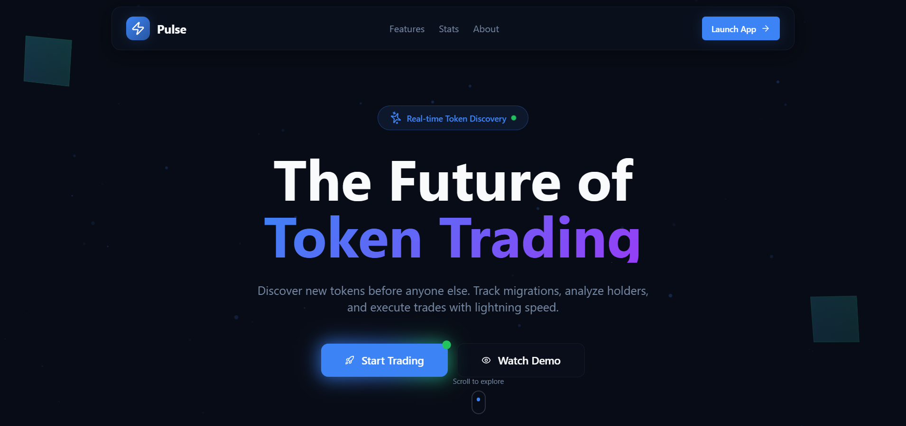
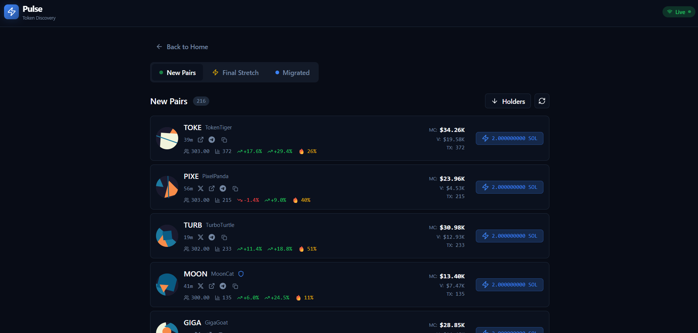
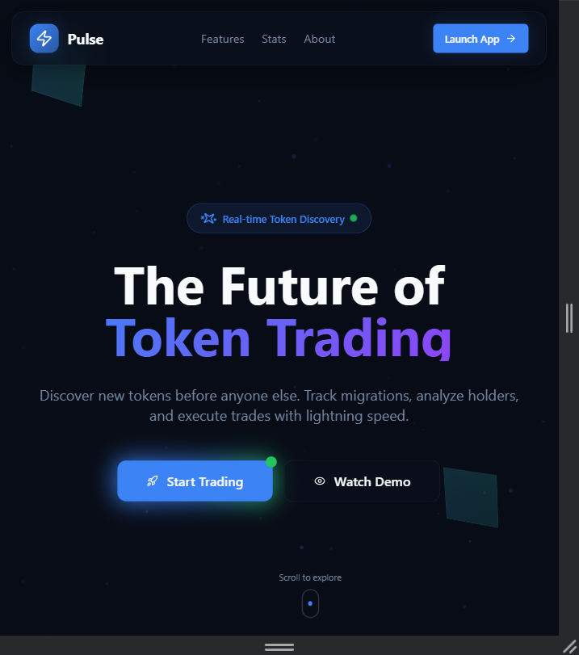
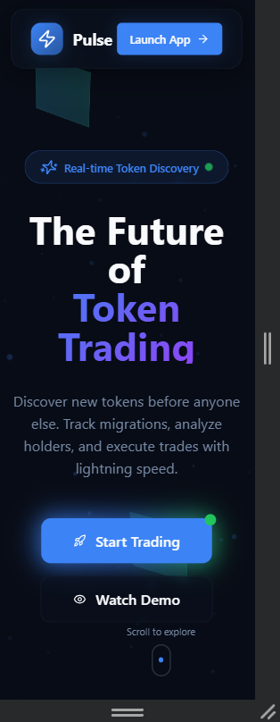

Pulse — Token Discovery Hub

A high-performance, real-time token market dashboard inspired by modern crypto trading platforms.
Built with production-grade architecture, smooth UI interactions, and real-time data simulations.

## 🖼️ Product Screenshots:

### 🏠 Homepage

### 📊 Trading Page

### 🖥️ Desktop View (1024px)

### 📱 Tablet View (768px)

### 📲 Mobile View (320px)

🔗 Live Demo

👉 https://pulse-token-discovery-hub.vercel.app/

🎥 Demo Video

👉 https://youtu.be/vNY3RqF_yFA

🚀 Key Features

Real-time token price updates (Mock WebSocket engine)

Token discovery categories

New Pairs

Final Stretch

Migrated Tokens

Advanced interactive data table

Column sorting

Hover & focus states

Tooltips and contextual popovers

Modal-based detailed token view

Smooth price-change animations

Color-coded transitions for gains/losses

Robust loading & error handling

Skeleton loaders

Shimmer effects

Global error boundaries

Fully responsive design

Optimized for 320px → large desktop

Pixel-perfect UI

Inspired by real-world crypto trading platforms

🧠 Technical Architecture

Frontend: React + TypeScript

Build Tool: Vite

Styling: Tailwind CSS + shadcn/ui

State Management: Redux Toolkit

Server State: React Query

Real-time Layer: Mock WebSocket Server

Error Handling: Centralized error boundaries

Performance Optimizations

Memoized components

Zero layout shifts (No CLS)

Sub-100ms UI interactions

📁 Project Structure
src/
├─ components/
│  ├─ trading/
│  └─ ui/
├─ hooks/
├─ services/
├─ store/
├─ types/
├─ pages/
└─ lib/

🛠️ Local Development Setup
git clone https://github.com/Ayan113/Pulse-Token-discovery-hub
cd token-discovery-hub
npm install
npm run dev

📱 Responsive Layout

The application is fully responsive and optimized across devices.

Mobile (320px)

Tablet (768px)

Desktop (1024px+)

📈 Performance & Quality

Lighthouse Score: ≥ 90 (Mobile & Desktop)

No Cumulative Layout Shift

Optimized re-renders

Scalable and maintainable architecture

📌 Project Focus

Pulse was built with a strong emphasis on:

Clean and scalable architecture

Reusable, composable components

Production-grade UI and UX quality

Recruiter-ready code standards

Real-world performance considerations

⭐ If you like this project, consider giving it a star!
